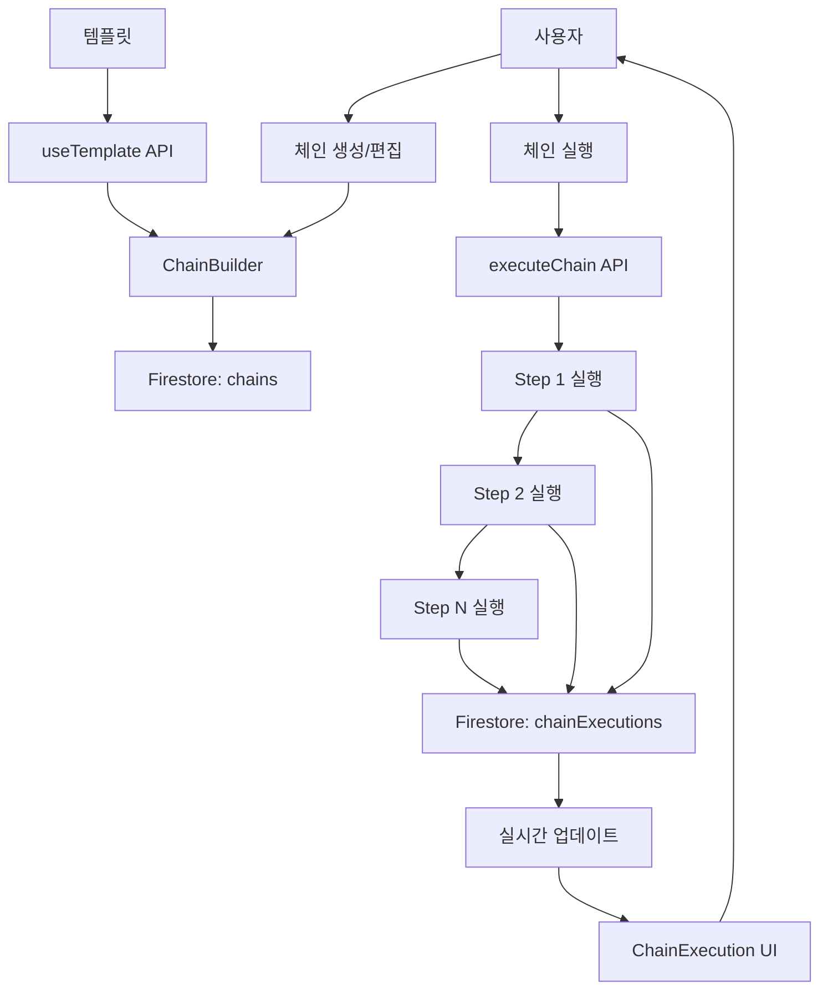

# Feature 10: 프롬프트 체인 - 설계 문서

## 1. 아키텍처 개요

### 시스템 플로우



### 실행 플로우 (ASCII)

```
┌─────────────────────────────────────────────────────────────┐
│                    체인 실행 플로우                           │
└─────────────────────────────────────────────────────────────┘

1. 사용자 입력
   └─> "2026년 AI 트렌드"

2. Step 1: 아이디어 생성
   ├─> Input: "2026년 AI 트렌드에 대한 아이디어 5가지"
   ├─> Claude API 호출
   └─> Output: "1. 멀티모달 AI의 진화\n2. AI 에이전트..."
       └─> 저장 → previous_output

3. Step 2: 아웃라인 작성
   ├─> Input: "다음 아이디어 중 최고 선택: [previous_output]"
   ├─> Claude API 호출
   └─> Output: "# 멀티모달 AI의 진화\n## 서론..."
       └─> 저장 → previous_output

4. Step 3: 초안 작성
   ├─> Input: "아웃라인 기반 초안: [previous_output]"
   ├─> Claude API 호출
   └─> Output: "2026년, 인공지능 분야에서..."
       └─> 저장 → previous_output

5. Step 4: 퇴고
   ├─> Input: "다음 초안 개선: [previous_output]"
   ├─> GPT-4 API 호출
   └─> Output: "2026년, 인공지능은 우리 삶의..."
       └─> 최종 결과

✓ 체인 완료!
```

### 데이터 흐름

```
User Input
    ↓
Chain Definition (Firestore)
    ↓
Execution Engine
    ↓
┌─────────────┐
│  Step Loop  │
│             │
│  previous_  │
│  output ────┼──> Next Step
│             │
└─────────────┘
    ↓
Chain Execution Record (Firestore)
    ↓
Real-time Updates
    ↓
UI Display
```

## 2. 데이터 모델

### TypeScript 타입 정의

```typescript
// client/src/types/chain.ts

export interface PromptChain {
  id: string;
  userId: string;
  name: string;
  description: string;
  category: 'blog' | 'video' | 'analysis' | 'creative' | 'custom';
  steps: ChainStep[];
  totalEstimatedCost: number;
  createdAt: Date;
  updatedAt: Date;
}

export interface ChainStep {
  id: string;
  order: number;                 // 1, 2, 3...
  name: string;                  // "아이디어 생성"
  promptTemplate: string;        // 변수 포함 ({{previous_output}}, {{initial_input}})
  modelId: string;               // 'claude-sonnet-4-5', 'gpt-4o', 'gemini-2.0-flash'
  usePreviousOutput: boolean;    // true면 이전 단계 출력 사용
  estimatedCost: number;         // 예상 비용 ($)
  description?: string;          // 단계 설명 (선택)
}

export interface ChainExecution {
  id: string;
  chainId: string;
  userId: string;
  status: 'running' | 'completed' | 'failed' | 'cancelled';
  currentStepIndex: number;      // 현재 실행 중인 단계 (0-based)
  stepResults: StepResult[];
  initialInput?: string;         // 사용자 초기 입력
  startedAt: Date;
  completedAt?: Date;
  totalCost: number;             // 실제 발생 비용
  totalDuration: number;         // 총 소요 시간 (ms)
  error?: string;
}

export interface StepResult {
  stepId: string;
  stepName: string;
  stepOrder: number;
  input: string;                 // 실제 실행된 프롬프트 (변수 치환 후)
  output: string;                // AI 응답
  modelUsed: string;
  duration: number;              // ms
  cost: number;                  // 실제 비용
  success: boolean;
  error?: string;
  executedAt: Date;
}

export interface ChainTemplate {
  id: string;
  name: string;
  description: string;
  category: 'blog' | 'video' | 'analysis' | 'creative' | 'custom';
  steps: Omit<ChainStep, 'id'>[];  // ID는 사용 시 생성
  isOfficial: boolean;
  usageCount: number;
  tags: string[];
  estimatedTime: number;         // 예상 소요 시간 (초)
  createdAt: Date;
}

// UI용 확장 타입
export interface ChainWithExecutions extends PromptChain {
  lastExecution?: ChainExecution;
  executionCount: number;
}

export interface TemplateWithPreview extends ChainTemplate {
  previewResults?: string[];     // 각 단계 예시 결과
}
```

### Firestore 스키마

#### Collection: `chains`

```typescript
{
  id: string;                    // auto-generated
  userId: string;                // indexed
  name: string;
  description: string;
  category: string;              // indexed
  steps: [
    {
      id: string;
      order: number;
      name: string;
      promptTemplate: string;
      modelId: string;
      usePreviousOutput: boolean;
      estimatedCost: number;
      description?: string;
    }
  ];
  totalEstimatedCost: number;
  createdAt: Timestamp;          // indexed
  updatedAt: Timestamp;
}
```

**인덱스**:
- `userId` + `category` (복합 인덱스)
- `userId` + `createdAt` (최근 생성순 조회)

#### Collection: `chainExecutions`

```typescript
{
  id: string;                    // auto-generated
  chainId: string;               // indexed
  userId: string;                // indexed
  status: string;                // 'running' | 'completed' | 'failed' | 'cancelled'
  currentStepIndex: number;
  stepResults: [
    {
      stepId: string;
      stepName: string;
      stepOrder: number;
      input: string;
      output: string;
      modelUsed: string;
      duration: number;
      cost: number;
      success: boolean;
      error?: string;
      executedAt: Timestamp;
    }
  ];
  initialInput?: string;
  startedAt: Timestamp;          // indexed
  completedAt?: Timestamp;
  totalCost: number;
  totalDuration: number;
  error?: string;
}
```

**인덱스**:
- `userId` + `status` (실행 중인 체인 조회)
- `chainId` + `startedAt` (체인별 실행 이력)
- `userId` + `startedAt` (최근 실행 조회)

#### Collection: `chainTemplates`

```typescript
{
  id: string;                    // auto-generated
  name: string;
  description: string;
  category: string;              // indexed
  steps: [
    {
      order: number;
      name: string;
      promptTemplate: string;
      modelId: string;
      usePreviousOutput: boolean;
      estimatedCost: number;
      description?: string;
    }
  ];
  isOfficial: boolean;           // indexed
  usageCount: number;            // indexed (인기순 정렬)
  tags: string[];
  estimatedTime: number;
  createdAt: Timestamp;
}
```

**인덱스**:
- `category` + `usageCount` (카테고리별 인기 템플릿)
- `isOfficial` + `usageCount` (공식 템플릿 인기순)

## 3. API 스펙 (tRPC)

### Router: `server/routers/chains.ts`

#### 1. createChain

```typescript
createChain: protectedProcedure
  .input(
    z.object({
      name: z.string().min(1).max(100),
      description: z.string().max(500),
      category: z.enum(['blog', 'video', 'analysis', 'creative', 'custom']),
      steps: z.array(
        z.object({
          order: z.number().int().positive(),
          name: z.string().min(1).max(100),
          promptTemplate: z.string().min(1),
          modelId: z.string(),
          usePreviousOutput: z.boolean(),
          estimatedCost: z.number().nonnegative(),
          description: z.string().optional(),
        })
      ).min(1).max(10),  // 최소 1단계, 최대 10단계
    })
  )
  .mutation(async ({ input, ctx }) => {
    // 1. 단계 ID 생성
    const steps = input.steps.map((step) => ({
      ...step,
      id: generateStepId(),
    }));

    // 2. 총 예상 비용 계산
    const totalEstimatedCost = steps.reduce(
      (sum, step) => sum + step.estimatedCost,
      0
    );

    // 3. Firestore에 저장
    const chain: PromptChain = {
      id: generateChainId(),
      userId: ctx.user.uid,
      name: input.name,
      description: input.description,
      category: input.category,
      steps,
      totalEstimatedCost,
      createdAt: new Date(),
      updatedAt: new Date(),
    };

    await createChainInDb(chain);

    return chain;
  });
```

**응답 예시**:
```typescript
{
  id: "chain_abc123",
  userId: "user_xyz",
  name: "블로그 작성 체인",
  description: "아이디어부터 완성까지",
  category: "blog",
  steps: [...],
  totalEstimatedCost: 0.085,
  createdAt: "2026-02-12T10:00:00Z",
  updatedAt: "2026-02-12T10:00:00Z"
}
```

#### 2. getChains

```typescript
getChains: protectedProcedure
  .input(
    z.object({
      category: z.enum(['blog', 'video', 'analysis', 'creative', 'custom']).optional(),
      limit: z.number().int().positive().max(100).default(20),
    })
  )
  .query(async ({ input, ctx }) => {
    let query = db
      .collection('chains')
      .where('userId', '==', ctx.user.uid)
      .orderBy('createdAt', 'desc')
      .limit(input.limit);

    if (input.category) {
      query = query.where('category', '==', input.category);
    }

    const snapshot = await query.get();
    const chains = snapshot.docs.map((doc) => ({
      id: doc.id,
      ...doc.data(),
    })) as PromptChain[];

    // 각 체인의 마지막 실행 정보 가져오기
    const chainsWithExecutions = await Promise.all(
      chains.map(async (chain) => {
        const lastExecution = await getLastExecution(chain.id);
        const executionCount = await getExecutionCount(chain.id);
        return {
          ...chain,
          lastExecution,
          executionCount,
        };
      })
    );

    return chainsWithExecutions;
  });
```

#### 3. getChainById

```typescript
getChainById: protectedProcedure
  .input(z.object({ chainId: z.string() }))
  .query(async ({ input, ctx }) => {
    const chain = await getChainFromDb(input.chainId);

    if (!chain) {
      throw new TRPCError({
        code: 'NOT_FOUND',
        message: '체인을 찾을 수 없습니다.',
      });
    }

    // 권한 확인
    if (chain.userId !== ctx.user.uid) {
      throw new TRPCError({
        code: 'FORBIDDEN',
        message: '권한이 없습니다.',
      });
    }

    return chain;
  });
```

#### 4. executeChain (핵심 API)

```typescript
executeChain: protectedProcedure
  .input(
    z.object({
      chainId: z.string(),
      initialInput: z.string().optional(),
    })
  )
  .mutation(async ({ input, ctx }) => {
    // 1. 체인 가져오기
    const chain = await getChainFromDb(input.chainId);

    if (!chain) {
      throw new TRPCError({
        code: 'NOT_FOUND',
        message: '체인을 찾을 수 없습니다.',
      });
    }

    // 권한 확인
    if (chain.userId !== ctx.user.uid) {
      throw new TRPCError({
        code: 'FORBIDDEN',
        message: '권한이 없습니다.',
      });
    }

    // 2. 실행 레코드 생성
    const execution: ChainExecution = {
      id: generateExecutionId(),
      chainId: chain.id,
      userId: ctx.user.uid,
      status: 'running',
      currentStepIndex: 0,
      stepResults: [],
      initialInput: input.initialInput,
      startedAt: new Date(),
      totalCost: 0,
      totalDuration: 0,
    };

    await saveExecution(execution);

    // 3. 백그라운드에서 체인 실행 (비동기)
    executeChainBackground(execution.id, chain, input.initialInput).catch(
      (error) => {
        console.error('[Chain] Execution failed:', error);
        // 실행 레코드에 에러 저장
        updateExecutionStatus(execution.id, 'failed', error.message);
      }
    );

    // 4. 실행 ID 즉시 반환
    return {
      executionId: execution.id,
      message: '체인 실행을 시작했습니다.',
    };
  });
```

#### 5. getChainExecution

```typescript
getChainExecution: protectedProcedure
  .input(z.object({ executionId: z.string() }))
  .query(async ({ input, ctx }) => {
    const execution = await getExecutionFromDb(input.executionId);

    if (!execution) {
      throw new TRPCError({
        code: 'NOT_FOUND',
        message: '실행 기록을 찾을 수 없습니다.',
      });
    }

    // 권한 확인
    if (execution.userId !== ctx.user.uid) {
      throw new TRPCError({
        code: 'FORBIDDEN',
        message: '권한이 없습니다.',
      });
    }

    return execution;
  });
```

#### 6. getChainTemplates

```typescript
getChainTemplates: publicProcedure
  .input(
    z.object({
      category: z.enum(['blog', 'video', 'analysis', 'creative', 'custom']).optional(),
      limit: z.number().int().positive().max(50).default(20),
      sortBy: z.enum(['popular', 'recent']).default('popular'),
    })
  )
  .query(async ({ input }) => {
    let query = db.collection('chainTemplates');

    if (input.category) {
      query = query.where('category', '==', input.category);
    }

    // 정렬
    if (input.sortBy === 'popular') {
      query = query.orderBy('usageCount', 'desc');
    } else {
      query = query.orderBy('createdAt', 'desc');
    }

    query = query.limit(input.limit);

    const snapshot = await query.get();
    return snapshot.docs.map((doc) => ({
      id: doc.id,
      ...doc.data(),
    })) as ChainTemplate[];
  });
```

#### 7. useChainTemplate

```typescript
useChainTemplate: protectedProcedure
  .input(
    z.object({
      templateId: z.string(),
      customizations: z
        .object({
          name: z.string().optional(),
          description: z.string().optional(),
        })
        .optional(),
    })
  )
  .mutation(async ({ input, ctx }) => {
    // 1. 템플릿 가져오기
    const template = await getTemplateFromDb(input.templateId);

    if (!template) {
      throw new TRPCError({
        code: 'NOT_FOUND',
        message: '템플릿을 찾을 수 없습니다.',
      });
    }

    // 2. 템플릿을 체인으로 복사
    const steps = template.steps.map((step, index) => ({
      ...step,
      id: generateStepId(),
    }));

    const chain: PromptChain = {
      id: generateChainId(),
      userId: ctx.user.uid,
      name: input.customizations?.name || `${template.name} (복사본)`,
      description:
        input.customizations?.description || template.description,
      category: template.category,
      steps,
      totalEstimatedCost: steps.reduce(
        (sum, step) => sum + step.estimatedCost,
        0
      ),
      createdAt: new Date(),
      updatedAt: new Date(),
    };

    await createChainInDb(chain);

    // 3. 템플릿 사용 횟수 증가
    await incrementTemplateUsage(template.id);

    return chain;
  });
```

#### 8. updateChain

```typescript
updateChain: protectedProcedure
  .input(
    z.object({
      chainId: z.string(),
      updates: z.object({
        name: z.string().min(1).max(100).optional(),
        description: z.string().max(500).optional(),
        category: z.enum(['blog', 'video', 'analysis', 'creative', 'custom']).optional(),
        steps: z.array(
          z.object({
            id: z.string().optional(),
            order: z.number().int().positive(),
            name: z.string().min(1).max(100),
            promptTemplate: z.string().min(1),
            modelId: z.string(),
            usePreviousOutput: z.boolean(),
            estimatedCost: z.number().nonnegative(),
            description: z.string().optional(),
          })
        ).min(1).max(10).optional(),
      }),
    })
  )
  .mutation(async ({ input, ctx }) => {
    const chain = await getChainFromDb(input.chainId);

    if (!chain || chain.userId !== ctx.user.uid) {
      throw new TRPCError({
        code: 'FORBIDDEN',
        message: '권한이 없습니다.',
      });
    }

    // 단계가 업데이트되면 ID 생성
    if (input.updates.steps) {
      input.updates.steps = input.updates.steps.map((step) => ({
        ...step,
        id: step.id || generateStepId(),
      }));
    }

    // 총 예상 비용 재계산
    let totalEstimatedCost = chain.totalEstimatedCost;
    if (input.updates.steps) {
      totalEstimatedCost = input.updates.steps.reduce(
        (sum, step) => sum + step.estimatedCost,
        0
      );
    }

    await updateChainInDb(input.chainId, {
      ...input.updates,
      totalEstimatedCost,
      updatedAt: new Date(),
    });

    return { success: true };
  });
```

#### 9. deleteChain

```typescript
deleteChain: protectedProcedure
  .input(z.object({ chainId: z.string() }))
  .mutation(async ({ input, ctx }) => {
    const chain = await getChainFromDb(input.chainId);

    if (!chain || chain.userId !== ctx.user.uid) {
      throw new TRPCError({
        code: 'FORBIDDEN',
        message: '권한이 없습니다.',
      });
    }

    await deleteChainFromDb(input.chainId);

    return { success: true };
  });
```

#### 10. cancelExecution

```typescript
cancelExecution: protectedProcedure
  .input(z.object({ executionId: z.string() }))
  .mutation(async ({ input, ctx }) => {
    const execution = await getExecutionFromDb(input.executionId);

    if (!execution || execution.userId !== ctx.user.uid) {
      throw new TRPCError({
        code: 'FORBIDDEN',
        message: '권한이 없습니다.',
      });
    }

    // 실행 중인 경우만 취소 가능
    if (execution.status !== 'running') {
      throw new TRPCError({
        code: 'BAD_REQUEST',
        message: '실행 중인 체인만 취소할 수 있습니다.',
      });
    }

    await updateExecutionStatus(input.executionId, 'cancelled');

    return { success: true };
  });
```

## 4. 실행 알고리즘

### 핵심 실행 함수

```typescript
// server/lib/chain-executor.ts

async function executeChainBackground(
  executionId: string,
  chain: PromptChain,
  initialInput?: string
): Promise<void> {
  console.log(`[Chain] Starting execution: ${executionId}`);

  let previousOutput = initialInput || '';
  const startTime = Date.now();

  try {
    for (let i = 0; i < chain.steps.length; i++) {
      const step = chain.steps[i];

      console.log(`[Chain] Executing step ${i + 1}/${chain.steps.length}: ${step.name}`);

      // 1. 현재 단계 인덱스 업데이트
      await updateCurrentStepIndex(executionId, i);

      // 2. 프롬프트 준비 (변수 치환)
      const finalPrompt = preparePrompt(
        step.promptTemplate,
        previousOutput,
        initialInput
      );

      // 3. AI 모델 실행
      const stepStartTime = Date.now();
      const result = await executeAIModel(step.modelId, finalPrompt);
      const stepDuration = Date.now() - stepStartTime;

      // 4. 단계 결과 저장
      const stepResult: StepResult = {
        stepId: step.id,
        stepName: step.name,
        stepOrder: step.order,
        input: finalPrompt,
        output: result.response,
        modelUsed: step.modelId,
        duration: stepDuration,
        cost: result.cost,
        success: true,
        executedAt: new Date(),
      };

      await addStepResult(executionId, stepResult);

      // 5. 다음 단계를 위해 출력 저장
      previousOutput = result.response;

      console.log(`[Chain] Step ${i + 1} completed in ${stepDuration}ms`);
    }

    // 전체 완료
    const totalDuration = Date.now() - startTime;
    await completeExecution(executionId, totalDuration);

    console.log(`[Chain] Execution completed: ${executionId} (${totalDuration}ms)`);
  } catch (error: any) {
    console.error(`[Chain] Execution failed:`, error);

    // 실패 처리
    await failExecution(executionId, error.message);

    throw error;
  }
}

/**
 * 프롬프트 템플릿에서 변수 치환
 */
function preparePrompt(
  template: string,
  previousOutput: string,
  initialInput?: string
): string {
  let result = template;

  // {{previous_output}} 치환
  if (previousOutput) {
    result = result.replace(/\{\{previous_output\}\}/g, previousOutput);
  }

  // {{initial_input}} 치환
  if (initialInput) {
    result = result.replace(/\{\{initial_input\}\}/g, initialInput);
  }

  return result;
}

/**
 * AI 모델 실행
 */
async function executeAIModel(
  modelId: string,
  prompt: string
): Promise<{ response: string; cost: number }> {
  // 모델별 분기
  switch (modelId) {
    case 'claude-sonnet-4-5':
      return await executeClaude(prompt, 'claude-sonnet-4-5');
    case 'claude-opus-4-6':
      return await executeClaude(prompt, 'claude-opus-4-6');
    case 'gpt-4o':
      return await executeOpenAI(prompt, 'gpt-4o');
    case 'gpt-4o-mini':
      return await executeOpenAI(prompt, 'gpt-4o-mini');
    case 'gemini-2.0-flash':
      return await executeGemini(prompt, 'gemini-2.0-flash-exp');
    default:
      throw new Error(`Unsupported model: ${modelId}`);
  }
}

/**
 * Claude 실행
 */
async function executeClaude(
  prompt: string,
  model: string
): Promise<{ response: string; cost: number }> {
  const anthropic = new Anthropic({
    apiKey: process.env.ANTHROPIC_API_KEY,
  });

  const message = await anthropic.messages.create({
    model,
    max_tokens: 4096,
    messages: [
      {
        role: 'user',
        content: prompt,
      },
    ],
  });

  const response = message.content[0].type === 'text'
    ? message.content[0].text
    : '';

  // 비용 계산 (간단한 예시)
  const inputTokens = message.usage.input_tokens;
  const outputTokens = message.usage.output_tokens;
  const cost = calculateClaudeCost(model, inputTokens, outputTokens);

  return { response, cost };
}

/**
 * OpenAI 실행
 */
async function executeOpenAI(
  prompt: string,
  model: string
): Promise<{ response: string; cost: number }> {
  const openai = new OpenAI({
    apiKey: process.env.OPENAI_API_KEY,
  });

  const completion = await openai.chat.completions.create({
    model,
    messages: [
      {
        role: 'user',
        content: prompt,
      },
    ],
    max_tokens: 4096,
  });

  const response = completion.choices[0]?.message?.content || '';

  // 비용 계산
  const inputTokens = completion.usage?.prompt_tokens || 0;
  const outputTokens = completion.usage?.completion_tokens || 0;
  const cost = calculateOpenAICost(model, inputTokens, outputTokens);

  return { response, cost };
}

/**
 * Gemini 실행
 */
async function executeGemini(
  prompt: string,
  model: string
): Promise<{ response: string; cost: number }> {
  const genAI = new GoogleGenerativeAI(process.env.GEMINI_API_KEY!);
  const geminiModel = genAI.getGenerativeModel({ model });

  const result = await geminiModel.generateContent(prompt);
  const response = result.response.text();

  // 비용 계산 (Gemini는 무료/저렴)
  const cost = 0.001; // 예시

  return { response, cost };
}

/**
 * 비용 계산 함수들
 */
function calculateClaudeCost(
  model: string,
  inputTokens: number,
  outputTokens: number
): number {
  const pricing = {
    'claude-sonnet-4-5': { input: 0.003, output: 0.015 },  // per 1K tokens
    'claude-opus-4-6': { input: 0.015, output: 0.075 },
  };

  const prices = pricing[model] || pricing['claude-sonnet-4-5'];

  return (
    (inputTokens / 1000) * prices.input +
    (outputTokens / 1000) * prices.output
  );
}

function calculateOpenAICost(
  model: string,
  inputTokens: number,
  outputTokens: number
): number {
  const pricing = {
    'gpt-4o': { input: 0.005, output: 0.015 },
    'gpt-4o-mini': { input: 0.00015, output: 0.0006 },
  };

  const prices = pricing[model] || pricing['gpt-4o'];

  return (
    (inputTokens / 1000) * prices.input +
    (outputTokens / 1000) * prices.output
  );
}
```

### Firestore 업데이트 함수들

```typescript
// server/lib/chain-db.ts

async function updateCurrentStepIndex(
  executionId: string,
  stepIndex: number
): Promise<void> {
  await db.collection('chainExecutions').doc(executionId).update({
    currentStepIndex: stepIndex,
  });
}

async function addStepResult(
  executionId: string,
  stepResult: StepResult
): Promise<void> {
  const execution = await getExecutionFromDb(executionId);

  if (!execution) {
    throw new Error('Execution not found');
  }

  execution.stepResults.push(stepResult);
  execution.totalCost += stepResult.cost;

  await db.collection('chainExecutions').doc(executionId).update({
    stepResults: execution.stepResults,
    totalCost: execution.totalCost,
  });
}

async function completeExecution(
  executionId: string,
  totalDuration: number
): Promise<void> {
  await db.collection('chainExecutions').doc(executionId).update({
    status: 'completed',
    completedAt: new Date(),
    totalDuration,
  });
}

async function failExecution(
  executionId: string,
  errorMessage: string
): Promise<void> {
  await db.collection('chainExecutions').doc(executionId).update({
    status: 'failed',
    error: errorMessage,
    completedAt: new Date(),
  });
}

async function updateExecutionStatus(
  executionId: string,
  status: 'running' | 'completed' | 'failed' | 'cancelled',
  error?: string
): Promise<void> {
  const updates: any = { status };

  if (error) {
    updates.error = error;
  }

  if (status !== 'running') {
    updates.completedAt = new Date();
  }

  await db.collection('chainExecutions').doc(executionId).update(updates);
}
```

### 에러 처리 전략

```typescript
// 단계 실행 중 에러 처리
try {
  const result = await executeAIModel(step.modelId, finalPrompt);
  // ...
} catch (error: any) {
  console.error(`[Chain] Step ${i + 1} failed:`, error);

  // 실패한 단계 결과 저장
  const stepResult: StepResult = {
    stepId: step.id,
    stepName: step.name,
    stepOrder: step.order,
    input: finalPrompt,
    output: '',
    modelUsed: step.modelId,
    duration: Date.now() - stepStartTime,
    cost: 0,
    success: false,
    error: error.message,
    executedAt: new Date(),
  };

  await addStepResult(executionId, stepResult);

  // 전체 실행 실패 처리
  throw error;
}
```

### 재시도 로직 (선택사항)

```typescript
async function executeAIModelWithRetry(
  modelId: string,
  prompt: string,
  maxRetries = 3
): Promise<{ response: string; cost: number }> {
  let lastError: Error | null = null;

  for (let attempt = 1; attempt <= maxRetries; attempt++) {
    try {
      return await executeAIModel(modelId, prompt);
    } catch (error: any) {
      lastError = error;
      console.error(`[Chain] Attempt ${attempt} failed:`, error.message);

      if (attempt < maxRetries) {
        // 지수 백오프
        const delay = Math.min(1000 * Math.pow(2, attempt - 1), 10000);
        await new Promise((resolve) => setTimeout(resolve, delay));
      }
    }
  }

  throw lastError;
}
```

## 5. 컴포넌트 설계

*(계속 작성 중...)*

이 문서는 매우 길어서 파일을 여러 개로 나누어 작성하겠습니다.
